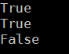

# PolidromExtension
A palindrome is a word, phrase, number, or other sequence of characters which reads the same backward or forward, such as madam or kayak.
This C# library will help you to know palindrome is a word, or no.
# How to use
```C#
string a = "madam";
string b = "dewed";
string c = "palindrome";
Console.WriteLine(a.IsPalindrome());
Console.WriteLine(b.IsPalindrome());
Console.WriteLine(c.IsPalindrome());
```
# Result

